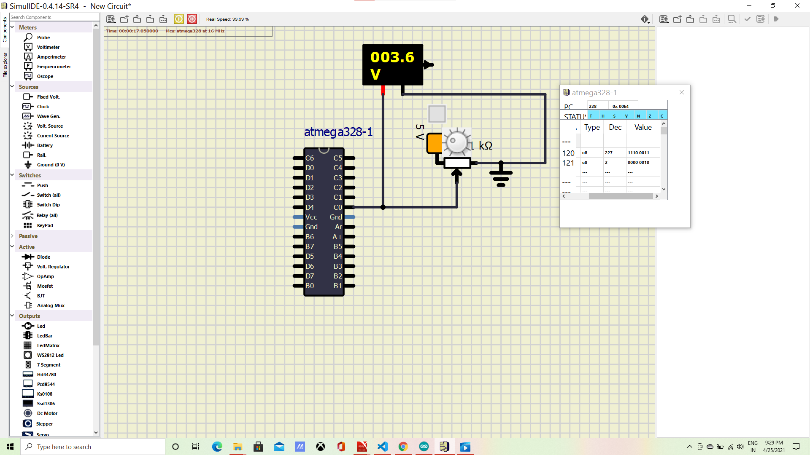

# Embedded C Programming Examples with Continuous Integration and Code Quality

## Actuator control using heater pin and button sensor pin

## In Action Activity1

|CASE1|CASE2|CASE3|CASE4|
|:--:|:--:|:--:|:--:|
|.png)|.png)|.png)|.png)|

## In Action Activity2

## BADGES

