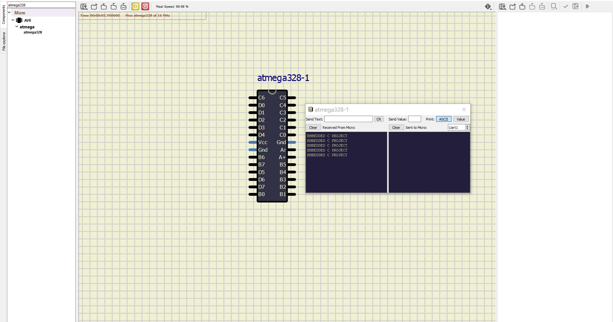

# Embedded C Programming Examples with Continuous Integration and Code Quality

## In Action Activity1

|CASE1|CASE2|CASE3|CASE4|
|:--:|:--:|:--:|:--:|
|.png)|.png)|.png)|.png)|

## In Action Activity2

|CASE1|CASE2|CASE3|CASE4|
|:--:|:--:|:--:|:--:|
|.png)|.png)|.png)|.png)|

## In Action Activity3

|CASE1|CASE2|CASE3|CASE4|
|:--:|:--:|:--:|:--:|
|.png)|.png)|.png)|.png)|

## In Action Activity4

|CASE1|
|:--:|
||

## BADGES

